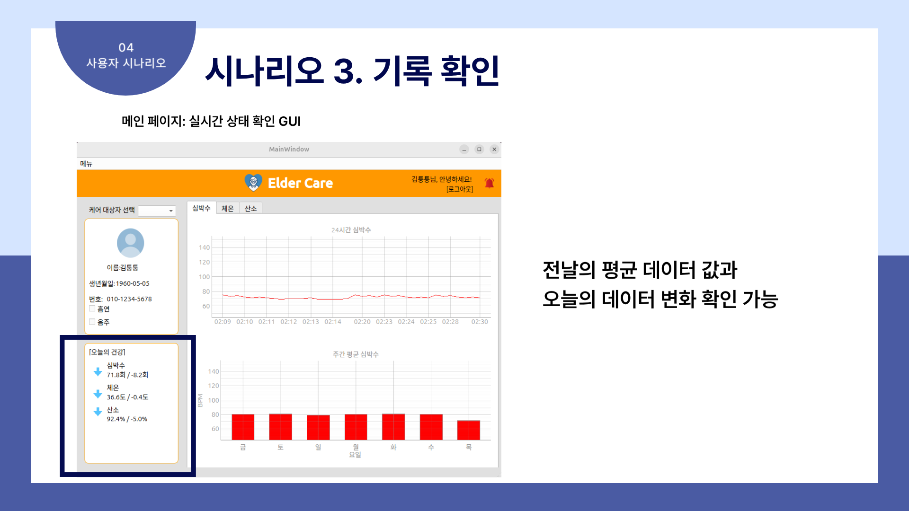

# 독거노인을 위한 스마트 헬스케어 IoT 시스템

## 📑 Table of Contents

1. [Presentation Slides](#️-presentation-slides)  
2. [Project Overview](#-project-overview)  
3. [Tung Kit Overview](#-tung-kit-overview)  
4. [Jira Timeline](#-jira-timeline)  
5. [Team Members & Roles](#-team-members--roles)  
6. [Tech Stack](#️-tech-stack)  
7. [User Requirements](#️-user-requirements)  
8. [System Requirements](#️-system-requirements)  
9. [System Architecture](#️-system-architecture)  
10. [Interface Specification](#-interface-specification)  
11. [Sequence Diagram](#-sequence-diagram)  
12. [User Scenario](#-user-scenario)  
13. [Entity-Relationship Diagram](#️-entity-relationship-diagram)  
14. [Conclusion & Improvement Points](#-conclusion--improvement-points)

## 🖥️ Presentation Slides
[발표자료 링크](https://docs.google.com/presentation/d/166BkdGzMQ-Qplzlb4l77-_WKpuYYVRcigNIudhQl_p8/edit?slide=id.p1#slide=id.p1)

## 📘 Project Overview

퉁퉁퉁퉁 헬스케어는 독거노인이 착용한 웨어러블 기기를 통해 심박수, 체온, 산소포화도를 실시간으로 측정하고 5분마다 서버에 전송하여, 위험 수치 감지 시 알림을 제공하며 하루 및 주간 통계, 전날 대비 변화, 약 복용 알림 기능 등을 통해 보호자가 PC에서 노인의 건강 상태를 통합적으로 모니터링할 수 있도록 하는 스마트 헬스케어 IoT 시스템입니다.

## 🔧 Tung Kit Overview

## 📅 Jira Timeline
(Jira 이미지)

## 👥 Team Members & Roles

| 이름       | 역할                                  |
| -------- | ----------------------------------- |
| 김민수 (팀장) |Jira 일정관리, HW 개발|
| 구민제      | Python Server 개발, 기획 및 설계  |
| 김범진      | PyQt GUI 개발          |
| 김채연      | Python Server 개발      |

## 🛠️ Tech Stack

| 분류       | 기술                                  |
| -------- | ----------------------------------- |
| 언어     |   |
| GUI      |  |
| 데이터베이스 |  |
| 하드웨어  |  |
| 협업 툴   |      |

## 🙋‍♂️ User Requirements

| ID             | 기능명                          | 확인 |
|----------------|--------------------------------|------|
| UR-01          | 평상시 건강 상태를 알고 싶다        | ✅  |
| UR-02          | 이상시 위험 알림을 받고 싶다        | ✅  |
| UR-03          | 실시간 모니터링을 하고 싶다         | ✅  |
| UR-04          | 종합 통계 데이터를 조회하고 싶다     | ✅  |

## ⚙️ System Requirements

| ID    | 기능명                 | 설명                          | 중요도 | 확인 |
| ----- | ------------------- | --------------------------- | --- | -- |
| SR-01 | 사용자 회원가입 기능         | 아이디, 비밀번호 입력으로 회원가입         | R   | ✅  |
| SR-02 | 사용자 로그인 기능          | 로그인 시 사용자 역할(노인/보호자/관리자) 선택 | R   | ✅  |
| SR-03 | 응답 표시 기능            | 로그인 실패, 저장 성공 등 안내 메시지 출력   | R   | ✅  |
| SR-04 | 위험 감지 기능            | 기준 수치를 벗어난 경우 위험으로 판단       | R   | ✅  |
| SR-05 | 위험 알림 기능            | 위험 감지 시 즉시 알림 전송            | R   | ✅  |
| SR-06 | 위험 알림 취소 기능         | 사용자가 직접 알림을 해제              | R   | ✅  |
| SR-07 | 신체 데이터 조회 기능        | 현재 생체 데이터 실시간 조회            | R   | ✅  |
| SR-08 | 일별 데이터 통계 조회 기능     | 날짜별 측정 데이터 확인               | R   | ✅  |
| SR-09 | 평균 데이터 비교 기능        | 연령대 평균 대비 비교 그래프 제공         | O   | ✅  |
| SR-10 | 약 복용 시간 등록 기능       | 알림 시간 및 주기 설정               | O   | ✅  |
| SR-11 | 약 복용 시간 수정 기능       | 기존 약 알림 수정                  | O   | ✅  |
| SR-12 | 대상자 목록 확인 기능        | 보호자가 노인 목록 확인               | R   | ✅  |
| SR-13 | 노인별 건강 상태 확인 기능     | 실시간 센서 수치 및 상태 확인           | R   | ✅  |
| SR-14 | 노인 약 복용 정보 확인 기능    | 대상자의 약 알림 설정 확인             | O   | ✅  |
| SR-15 | 관리자 로그인 기능          | 관리자 계정 로그인                  | R   | ✅  |
| SR-16 | 전체 사용자 데이터 통계 조회 기능 | 전체 데이터 통계 제공                | R   | ✅  |
| SR-17 | 성별/연령별 통계 기능        | 집계된 통계 데이터 시각화              | R   | ✅  |
| SR-18 | 실시간 센서 데이터 표시       | 실시간 센서 수치 표시                | R   | ✅  |
| SR-19 | 실시간 데이터 감지 기능       | 위험 수치 실시간 감지 및 대응           | R   | ✅  |

## 🏗️ System Architecture

## 🔌 Interface Specification

### **Command Summary**
| 명령어 | 전체 이름                 | 설명                             |
| --- | --------------------- | ------------------------------ |
| SU  | Send Uid              | 서버에 RFID TAG UID 값을 보냄         |
| GN  | Get Name              | 서버로부터 사용자의 이름을 받아옴             |
| GE  | Get Error             | 사용자 정보가 없을 때 서버에서 에러 수신        |
| SD  | Send Sensor Data      | 센서 데이터(심박수, 산소포화도, 체온)를 서버로 전송 |
| SS  | Send Alertlog Start   | 위험 상황 발생 시 알림 로그 시작 전송         |
| SE  | Send Alertlog End     | 위험 종료 시 알림 로그 종료 전송            |
| GM  | Get Medicine Reminder | 서버로부터 약 복용 시간에 따른 약 이름 수신      |
| ER  | Error Occur           | 서버에서 예기치 못한 에러 발생 시 에러 출력      |

### **Device ↔ Server TCP Protocol Specification**
| Interface ID | 기능 설명          | 송신자    | 수신자    | 데이터 형식 및 설명                                              |
| ------------ | -------------- | ------ | ------ | -------------------------------------------------------- |
| IF-01        | 사용자 확인 요청      | Serial | TCP    | `{SU}{TAG UID}{\n}` (TAG UID: 32자리)                     |
| IF-02        | 사용자 확인 응답 (성공) | TCP    | Serial | `{GN}{Status}{NAME}{\n}` (utf-8 한글: 1자 3바이트)            |
| IF-03        | 사용자 확인 응답 (에러) | TCP    | Serial | `{GE}{Status}{ERROR}{\n}` (`404`: 사용자 없음, `500`: 서버 오류) |
| IF-04        | 센서 데이터 전송      | Serial | TCP    | `{SD}{Heart_rate}{SpO2}{Temperature}{\n}` 모든 값은 3바이트 |
| IF-05        | 위험 시작 로그 전송    | Serial | TCP    | `{SS}{alert_type}{\n}` (`1`: 감지, `0`: 정상)               |
| IF-06        | 위험 종료 로그 전송    | Serial | TCP    | `{SE}{alert_type}{\n}` (`1`: 종료됨)                       |
| IF-07        | 약 복용 시간 알림     | TCP    | Serial | `{GM}{med_name}{\n}` (약 이름: 20바이트)                      |
| IF-08        | 에러 코드 전송       | Serial | ER     | `{ER}{status}{ERROR}` (`DB`, `FT`, `AU`, `CM`, `SV`)     |

### **Server Response Messages**
| 상황                    | 응답 메시지               | 상태 코드 |
| --------------------- | -------------------- | ----- |
| `elderly_id` 없음       | 존재하지 않는 케어대상자 ID입니다. | 404   |
| `elderly_id`가 보호자일 경우 | 해당 ID는 보호자 계정입니다.    | 400   |
| 이미 등록 신청 (valid = 0)  | 이미 신청한 케어대상자입니다.     | 409   |
| 이미 등록 완료 (valid = 1)  | 이미 등록된 케어대상자입니다.     | 409   |
| 등록 가능                 | 등록 가능한 케어대상자입니다.     | 200   |

### **Client ↔ Server HTTP Specification**

 Client ↔ Server HTTP Specification 보기

| ID    | 기능 설명               | Endpoint                          | Method | Request Data 요약                                           |
| ----- | ------------------- | --------------------------------- | ------ | --------------------------------------------------------- |
| IF-01 | 보호자 회원가입 요청         | /auth/guardian                    | POST   | user\_id, password, name, birth\_date, phone, elderly\_id |
| IF-02 | 아이디 중복 확인 요청        | /auth/check\_id                   | POST   | user\_id                                                  |
| IF-03 | 케어대상자 회원가입 요청       | /auth/elderly                     | POST   | user\_id, password, name, birth\_date, phone, rfid        |
| IF-04 | 케어대상자 ID 확인 요청      | /auth/check-elderly-id            | POST   | user\_id, elderly\_id                                     |
| IF-05 | 로그인 요청              | /auth                             | POST   | user\_id, password                                        |
| IF-06 | 메인페이지\_개인정보 요청 (노인) | /main/user-detail-info            | POST   | user\_id                                                  |
| IF-07 | 메인페이지\_케어대상자 목록 요청  | /main/elderly-list                | POST   | user\_id                                                  |
| IF-08 | 전날 평균 센서데이터 요청      | /main/avg-sensor-data             | POST   | user\_id                                                  |
| IF-09 | 0시부터 현재까지 평균 데이터 요청 | /main/sensor-data                 | POST   | user\_id                                                  |
| IF-10 | 24시간 맥박 데이터 요청      | /main/total-heart-data            | POST   | user\_id                                                  |
| IF-11 | 24시간 체온 데이터 요청      | /main/total-temp-data             | POST   | user\_id                                                  |
| IF-12 | 24시간 산소포화도 데이터 요청   | /main/total-spo2-data             | POST   | user\_id                                                  |
| IF-13 | 7일간 맥박 평균 요청        | /main/avg7-heart-data             | POST   | user\_id                                                  |
| IF-14 | 7일간 체온 평균 요청        | /main/avg7-temp-data              | POST   | user\_id                                                  |
| IF-15 | 7일간 산소포화도 평균 요청     | /main/avg7-spo2-data              | POST   | user\_id                                                  |
| IF-16 | 위험 알림 요청            | /main/alert                       | POST   | user\_id                                                  |
| IF-17 | 날짜별 체온 요청           | /query/cal-temp                   | POST   | user\_id, date                                            |
| IF-18 | 날짜별 맥박 요청           | /query/cal-heart                  | POST   | user\_id, date                                            |
| IF-19 | 날짜별 산소포화도 요청        | /query/cal-spo2                   | POST   | user\_id, date                                            |
| IF-20 | 약 알림 리스트 확인 요청      | /med/list                         | POST   | user\_id                                                  |
| IF-21 | 약 알림 추가 요청          | /med/add                          | POST   | user\_id, med\_name, end\_date, day\_of\_week, time       |
| IF-22 | 등록된 약 이름 리스트 요청     | /med/check-med-name               | POST   | user\_id                                                  |
| IF-23 | 약 알림 삭제 요청          | /med/delete                       | POST   | user\_id, med\_name, end\_date, day\_of\_week, time       |
| IF-24 | 특정 약 이름 삭제 요청       | /med/delete-med-name              | POST   | user\_id, med\_name                                       |
| IF-25 | 케어 대상자 연동 요청        | /connect/guardian-elderly         | POST   | user\_id, elderly\_id                                     |
| IF-26 | 보호자 연동 요청 확인        | /connect/elderly-guardian         | POST   | user\_id                                                  |
| IF-27 | 보호자 연동 수락           | /connect/elderly-guardian/accept  | POST   | user\_id, guardian\_id                                    |
| IF-28 | 보호자 연동 거절           | /connect/elderly-guardian/decline | POST   | user\_id, guardian\_id                                    |

## 🔄 Sequence Diagram

## 🧑‍💼 User Scenario

 Scenario_1_Sign_Up_and_Device_Pairing

 Scenario_2_Real_Time_Sensor_Monitoring

 Scenario_3_Viewing_Health_Records

 Scenario_4_Guardian_Linking

 Scenario_5_Medication_Reminder_Management

 Scenario_6_Managing_Multiple_Elderly_Users

## 🗂️ Entity-Relationship Diagram

## 🔚 (Conclusion & Improvement Points)
### 결론
1. 시스템 구현 완료
    - 하드웨어와 GUI가 서버와 통신하며 안정적으로 동작함
2. 실시간 모니터링 가능
    - 보호자 또는 독거노인 본인이 착용 기기를 통해 실시간 상태 확인 가능
3. 확장 가능성 확보
    - 향후 관리자를 위한 별도 GUI 기능 추가를 목표로 함

### 보완점
1. 센서 정확도 개선 필요
    - 맥박 및 산소포화도 측정의 성능이 아쉬움
2. 약 알림 전송 기능 미구현
    - 알림 등록은 가능하나, 실제 알림 전송 기능은 미완성 상태
3. 개인정보 및 관리자 기능 부족
    -사용자 개인정보 수정 페이지 및 관리자용 GUI가 아직 없음